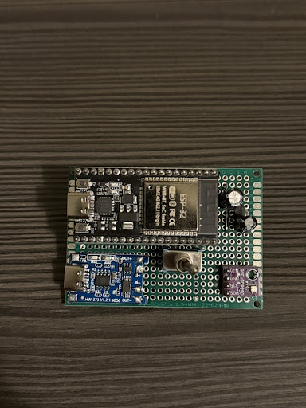
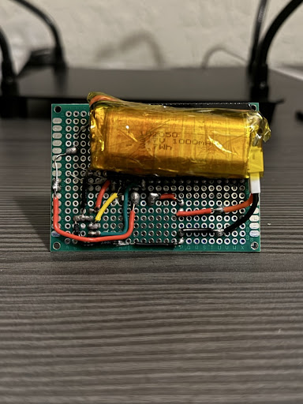
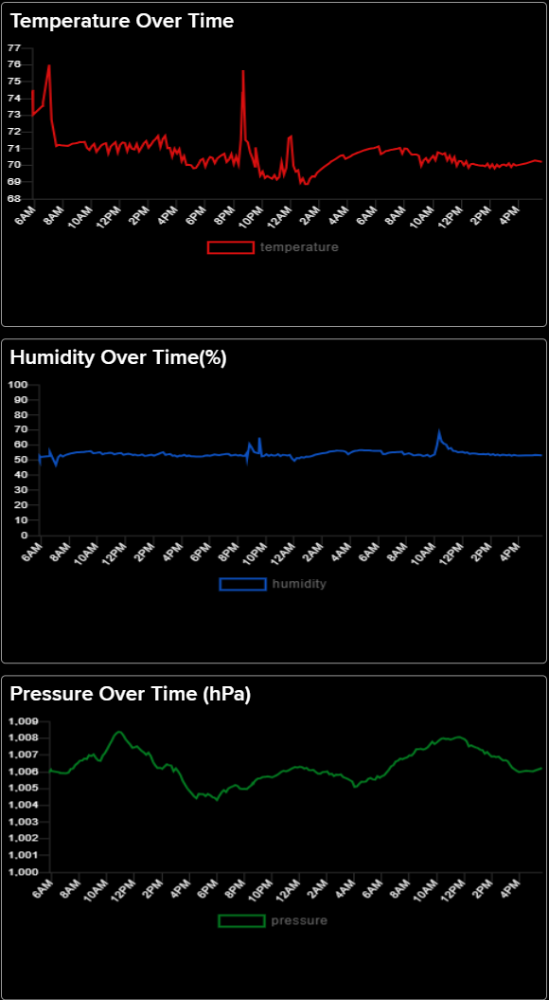

# ESP32 Indoor Plant Climate Monitor 🌿

A precision IoT monitoring node designed to track the micro-climate of sensitive indoor plants. This project transitions a breadboard prototype into a permanent, low-power hardware solution for 24/7 environmental telemetry.

## Hardware Build

  
  

## Technical Specifications
* **MCU:** ESP32 DevKit V1 (38-pin)
* **Sensor:** Bosch BME280 (I2C)
* **Power Management:** MCP1700-3302E LDO for ultra-low quiescent current.
    * TP4056 charging module with low-side protection logic.
    * **Deep Sleep Floor:** ~6.6mA (Limited by DevKit onboard USB-Serial hardware).
* **Hardware Switching:** GPIO 23 acts as a high-side power switch for the BME280 to eliminate sensor drain during sleep.

## Data Visualization
The following data was captured over a 36-hour period, demonstrating stable deep-sleep cycles and consistent WiFi telemetry.

## Project Goals
This project serves as a deep-dive into **Ultra-Low Power IoT Architecture** and **Wireless Telemetry**.

* **Power Optimization:** Reducing the deep-sleep floor of an off-the-shelf DevKit through hardware modifications (LDO bypass) and software-controlled peripheral isolation.
* **Network Reliability:** Implementing efficient WiFi handshake logic and fail-safe error handling to ensure data integrity without wasting battery on failed connection attempts.
* **Scalable Monitoring:** Building a bridge between local hardware sensors (BME280) and cloud-based analytics (Adafruit IO) using RESTful APIs.
## Future Roadmap
* Transition from DevKit to bare ESP32-WROOM module to reach micro-amp sleep levels.
* Design a custom PCB in KiCad to replace the current perfboard assembly.
