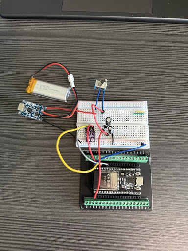

# ESP32 Low-Power Weather Station

A self-contained IoT weather node optimized for long-term battery operation. This project transitions a breadboard prototype to a permanent 5x7cm perfboard build.

## Hardware Build
| Top View | Bottom View |
| :---: | :---: |
|  |  |

### Prototype

## Technical Specifications
* **MCU:** ESP32 DevKit V1 (38-pin)
* **Sensor:** Bosch BME280 (I2C)
* **Power Management:** * MCP1700-3302E LDO for ultra-low quiescent current.
    * TP4056 charging module with low-side protection logic.
    * **Deep Sleep Floor:** ~6.6mA (Limited by DevKit onboard USB-Serial hardware).
* **Hardware Switching:** GPIO 23 acts as a high-side power switch for the BME280 to eliminate sensor drain during sleep.

## Project Goals
The primary objective was optimizing power consumption for a 3.7V Li-Po power source and implementing a reliable fail-safe handshake between the ESP32 and I2C peripherals.

## Future Roadmap
* Transition from DevKit to bare ESP32-WROOM module to reach micro-amp sleep levels.
* Design a custom PCB in KiCad to replace the current perfboard assembly.
